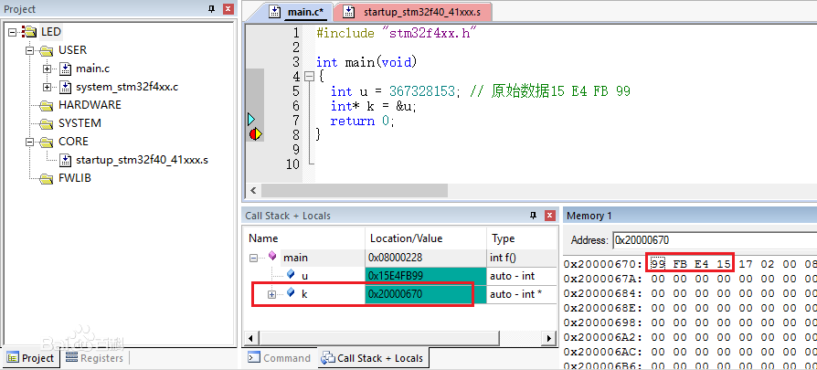
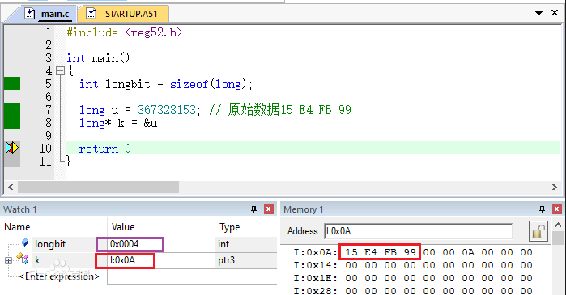
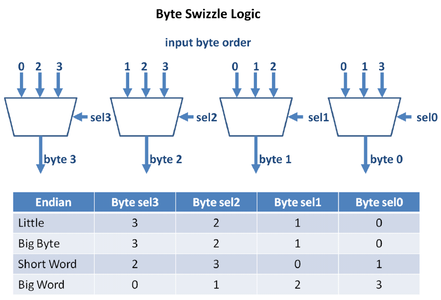

# Resource

https://en.wikipedia.org/wiki/Endianness

# Endian -> byte

通信单元(bit, byte, word, double word) **transmission sequence**

 "Gulliver's Travels"《格利佛游记》，该小说在描述Gulliver畅游小人国时碰到了如下的一个场景：

| 水煮蛋该从哪端开始剥   | 对立队伍                              | 字节 传送顺序 |
| ---------------------- | ------------------------------------- | ------------- |
| 大的一端（Big-End）    | 从大的一端剥开的人 称作Big-Endians    | 从 高位       |
| 小的一端（Little-End） | 从小的一端剥开的人 称作Little-Endians | 从 低位       |
# CPU

Diff - CPU, Diff [Intger] in Memory

|        | BE (big-endian)                                              | LE (little-endian)                                           |
| ------ | ------------------------------------------------------------ | ------------------------------------------------------------ |
| Define | 将高序字节存储在起始地址（高位编址）                         | 将低序字节存储在起始地址（低位编址）                         |
| 特点   | 最直观：反向（address 与 value）                             | 最符合人的 思维的：一致                                      |
| 字节序 | **address - low** 存储 **Value - high**，地址高位存储值的低位。 | **address - low** 位存储 **value - low**，地址高位存储值的高位 |
| Why?   | 不要考虑对应关系：<br />把**内存地址从左到右**按照**由低到高**的顺序写出，把**值**按照通常的**高位到低位**的顺序写出；两者对照，一个字节一个字节的填充进去 | 从人的第一观感来说：<br />低位值小，就应该放在内存地址小的地方，也即内存地址低位；反之，高位值就应该放在内存地址大的地方，也即内存地址高位 |
|        | PowerPC, SparC (Russion, China)                              | Intel, Arm (USA, European)                                   |


| byte     | bit - 1          | byte - 8 bit    | word - 16 bit  | double word - 32 bit     |               |
| -------- | ---------------- | --------------- | -------------- | ------------------------ | ------------- |
| **POC**  | double - 8 bytes | float - 4 bytes | long - 4 bytes | int - 2 bytes            | char - 1 byte |
| **0xFF** | 0xF - 4bit       | 0xFF - 8bit     | 0xFF = byte    | 0xFF => represent a byte |               |

# TCP/IP

<https://www.cnblogs.com/atong/p/3425926.html>

|                          | Endian             | Description                                                  |
| ------------------------ | ------------------ | ------------------------------------------------------------ |
| Network Order 网络字节序 | BE                 | TCP/IP各层协议将字节序定义为Big Endian                       |
| Host Order 主机字节序    | Follow CPU<br />LE | 2 Hosts through TCP/IP<br />Need Conversion => 主机序列(Little Endian) => 网络序(Big Endian) swap |
|                          | BE                 | No need conversion                                           |
| Cross OS                 | BE-LE              | Need:Protocal is BE, Os (windows) use LE                     |


**主机序（Host Order）- Little-Endian**。when two hosts 通过**TCP/IP**协议 => swap 进行主机序 （Little-Endian）和网络序（Big-Endian）的转换。

CPU - GPU is same as Host - Client. Therefore, TCP commnication is similar with CPU Bus <=> GPU Memory

# Memory Sequence

字节序 - 内存中存放的顺序。=> across OS, Network Transmission

4000 4001 4002 4003 
—————————–>

|                                       | big-endian | little-endian |
| ------------------------------------- | ---------- | ------------- |
| 0x01020304 (DWORD 32 bit = 8 * 4 bit) | BE01020304 | LE04030201    |

0x1234abcd写入到以0x0000开始的内存中，则结果为

| 内存   | big-endian | little-endian |
| ------ | ---------- | ------------- |
| 0x0000 | 0x12       | 0xcd          |
| 0x0001 | 0x34       | 0xab          |
| 0x0002 | 0xab       | 0x34          |
| 0x0003 | 0xcd       | 0x12          |
## MSB & LSB

<https://www.cnblogs.com/atong/p/3425926.html>

|      | Full Name                          | Position |
| ---- | ---------------------------------- | ------------------ |
| MSB  | Most Significant Bit - 最高有效位  | LMB - Left Most Bit (在一个n位二进制数字中n-1位) |
| LSB  | Least Significant Bit - 最低有效位 | RMB - Right Most bit |

### Samples

| Format                    | Value                                   | Description                                                  |
| ------------------------- | --------------------------------------- | ------------------------------------------------------------ |
| integer                   | 123456789                               |                                                              |
| binary                    | 0000 0111 0101 1011 1100 1101 0001 0101 | (从右向左，每4bit对齐，最左边(高位)不够用0补齐) <br />=> LSB - bit 0; MSB - bit 1 |
| Hex (0x)                  | 0　7　5　B　C　D　1　5                  | 高位字节：0x07 ; 低位字节：0x15                              |
| LE (int 16bit, int 32bit) | 0x15 0xCD 0x5B 0x07                     | 0-1-2-3，低位在前，人性                                      |
| BE(int32) - follow Hex    | 0x07 0x5B 0xCD 0x15                     | [3-2-1-0]，高位在前，直观                                    |
| * BE(int16)               | 0xCD 0x15 0x07 0x5B                     | [1-0] [3-2]，16 bit is unit => first 2 bytes swap, last 2 bytes swap |

C# - as C/C++ follow cpu

Java - JVM use BE

BE | LE is dependent by CPU

## 高低 地址

C 程序映像中内存的空间布局情况：在《C专 家编程》中或者《Unix环境高级编程》

```
----------------------- 最高内存地址 0xffffffff
栈底
栈
栈顶
-----------------------

NULL (空洞) 
-----------------------
堆
-----------------------
未初始 化的数据
----------------------- 统称数据段
初始化的数据
-----------------------
正 文段(代码段)
----------------------- 最低内存地址 0x00000000
```
在栈 上分配一个unsigned char buf[4]，那么这个数组变量在栈上是如何布局的呢？看下图：
```
栈底 （高地址）
----------
buf[3] 
buf[2]
buf[1]
buf[0]
----------
栈顶 （低地址）
```

## 高低 字节

左边 - 高位， 右边 - 低位

0X12345678 (高位 -> 低位)：0x12, 0x34, 0x56, 0x78

# Category

## Big-Endian

高位优先 - 低地址存放高位，如下图：

```
栈底 （高地址）
---------------
buf[3] (0x78) -- 低位
buf[2] (0x56)
buf[1] (0x34)
buf[0] (0x12) -- 高位
---------------
栈顶 （低地址）
```
**bit序列 中的序号编排方式如下**（以双字节数0x8B8A为例）：

```
bit 0 1 2 3 4 5 6 7 8 9 10 11 12 13 14 15
+-----------------------------------------+
val | 1 0 0 0 1 0 1 1 | 1 0 0 0 1 0 1 0 |
+----------------------------------------+
```

=> IBM3700系列、PDP-10、Mortolora微处理器系列和绝大多数的RISC处理器

**优点：**靠首先提取高位字节，你总是可以由看看在偏移位置为0的字节来确定这个数字是 正数还是负数。**你不必知道这个数值有多长，或者你也不必过一些字节来看这个数值是否含有符号位**。**这个数值是以它们被打印出来的顺序存放的**，所以**从二进制到十进制的函数特别有效**。因而，对于不同要求的机器，在设计存取方式时就会不同。

##  Little-Endian

低位优先 - 低地址存放低位，如下图：

```
栈底 （高地址）
---------------
buf[3] (0x12) -- 高位
buf[2] (0x34)
buf[1] (0x56)
buf[0] (0x78) -- 低位
--------------
栈 顶 （低地址）
```

**bit序列 中的序号编排方式如下**（以双字节数0x**8B8A**为例）：

```
bit 15 14 13 12 11 10 9 8 7 6 5 4 3 2 1 0
+-----------------------------------------+
val | 1 0 0 0 1 0 1 1 | 1 0 0 0 1 0 1 0 |
+-----------------------------------------+
```

=> PDP-11、VAX、**Intel系列 微处理器**和一些网络通信设备

**优点：提取一个，两个，四个或者更长字节数据的汇编指令以与其他所有格式相同的方式进行**：首先在**偏移地址为0的地方提取最低位的字节，因为地址偏移和字节数是一对 一的关系，多重精度的数学函数就相对地容易写了**。

## Middle-Endian

以4个字节为例：**3-4-1-2 or 2-1-4-3**

=> 偶尔会在一些小 型机体系中的十进制数的压缩格式中出现。

# Check Endian Style

https://baike.baidu.com/item/%E5%A4%A7%E5%B0%8F%E7%AB%AF%E6%A8%A1%E5%BC%8F/6750542?fr=aladdin

## 联合体union

union的存放顺序是所有成员都从低地址开始存放**，利用该特性就可以**轻松地获得了CPU对内存采用Little- endian还是Big-endian模式读写。例如：

```c
int checkCPUendian(){
union {
unsigned int a;
unsigned char b;            
}c;
c.a = 1;
return (c.b == 1);   
}   /*return 1 : little-endian, return 0:big-endian*/
```

## Check IDE:

```c
short int x;
char x0,x1;
x=0x1122;
x0=((char*)&x)[0]; //低地址单元
x1=((char*)&x)[1]; //高地址单元
```

若x0=0x11,则是 BE; 若x0=0x22,则是LE......

从上面的程序还可以看出，数据寻址时，用的是低位字节的地址。

```c
#definesw16(x)\
　((short)(\
　(((short)(x)&(short)0x00ffU)<<8)|\
　(((short)(x)&(short)0xff00U)>>8)))
```

## Check OS

```c
static union { char c[4]; unsigned long l; }endian_test = { { 'l', '?', '?', 'b' } };
#define ENDIANNESS ((char)endian_test.l)
```

(如果ENDIANNESS=’l’表示系统为little endian,为’b’表示big endian )。

## Test

```c
//CPU大小端
//0,小端模式;1,大端模式.
static u8 cpu_endian;

//获取CPU大小端模式,结果保存在cpu_endian里面
void find_cpu_endian(void)
{ 
 int x=1;
 if(*(char*)&x==1)cpu_endian=0; //小端模式 
 else cpu_endian=1;    //大端模式  
}
```

以上测试,在STM32上,你会得到cpu_endian=0,也就是小端模式.

小端模式的测试，一般arm都默认是 LE



BE 的测试：



# Conversion

## GPU

 *\<\<Notes on Endian Conversion.pdf>>*

### GPU Assumptions

| GPU Memory Access                    | Generated by | Used by   | Swap                     |
| ------------------------------------ | ------------ | --------- | ------------------------ |
| Command, index, vertices             | *CPU*        | **GPU**   | Yes                      |
| Texture memory                       | *CPU*        | **GPU**   | Yes <br />(Uncompressed) |
| Frame Buffer memory                  | **GPU**      | **GPU**   | **No**                   |
| Display memory                       | **GPU**      | *CPU*/Soc | Yes                      |
| **GPU** Reads/Writes to *CPU* Memory |              |           | Yes                      |

> Vivante’s GPU is LE
> CPU/Soc BE cooperate with GPU -> need **conversion**:
>
> No need:
> - GPU inside: **Frame Buffer memory**<= is only produced and consumed by GPU
> - CPU inside (no GPU)

### Supported Formats and Conversions

|                         | Gen \| Use       | Format               | Conversion (byte swap)                                       |
| ----------------------- | ---------------- | -------------------- | ------------------------------------------------------------ |
| Command                 | *CPU* \| **GPU** | * 32-bit words       | Yes, on the 32-bit word boundary                             |
| Index                   | *CPU* \| **GPU** | 8-bit,16-bit, 32-bit | Yes, short word, word                                        |
| Vertex                  | *CPU* \| **GPU** | …                    | Yes, …                                                       |
| Texture                 | *CPU* \| **GPU** | …                    | Yes, …<br />***No***, Compressed texture<br />(non-standard above byte formats, the bit stream is represented in bytes) |
| Frame Buffer            | **GPU**          |                      | ***No***, produced and consumed inside GPU                   |
| Display Memory          | **GPU** \| *CPU* | …                    | Yes, Display memory is under Soc/CPU control<br />GPU => convert rendered buffer |
| *CPU* Memory Read/Write | **GPU**          | …                    | Yes                                                          |

> *is multiple
> … is Standard byte formats: **byte (8-bit), short word (16-bit), word (32-bit)**
>
> 8-bit boundary no need swap (<= it’s byte unit); 
> Yes - Need Conversion
> No  - No need

### Conversion Mechanism by Swizzle => Similar Shader Swizzle

Swizzle is under 2-bits control, Each memory client has own swizzle. 

| Bit Value | Word                | Description                                               |
| :-------: | ------------------- | --------------------------------------------------------- |
|    00     |                     | Do nothing                                                |
|    01     | short word (16-bit) | Bytes on 16-bit **boundary**: 0123 -> 1032  (below graph) |
|    10     | word (32-bit)       | Bytes on 32-bit **boundary**: 0123 -> 3210                |
|    11     |                     | Reserved                                                  |



>  Boss opinion: typo error
>
> - Short word => Little word (little endian 32-bit word)   
> - BE 16-bit short integer: byte order => just reverse of two bytes of LE 16-bit integer

> My opinion:
>
> *Error: graph last byte index(legend) should be: byte 0,  byte 1,  byte 2,  byte 3
>
> Grpah result => 1-0-3-2 => short word (16 bits)
>
> Endian - swizzle byte format
> selX - serial No.
>
> > Little - **LE**: 3-2-1-0
> > Big Byte - ?
> > Big Word - **BE**: 0-1-2-3
> > Short Word - **ME**：2-3-0-1 or 1-0-3-2
>
> | Endian           | Byte sel3 | Byte sel2 | Byte sel1 | Byte sel0 |
> | ---------------- | --------- | --------- | --------- | --------- |
> | Little 16bit     | 3         | 2         | 1         | 0         |
> | Little 32bit     | 3         | 2         | 1         | 0         |
> | Big Byte - 16bit | 2         | 3         | 0         | 1         |
> | Big Word - 32bit | 0         | 1         | 2         | 3         |
>
> 

------

## TCP/IP Conversion

```c#
using System;

namespace Framework.NetPackage.Common
{
    /// <summary>
    /// 字节序转换辅助类
    /// </summary>
    public static class Endian
    {
        public static short SwapInt16(this short n)
        {
            return (short)(((n & 0xff) << 8) | ((n >> 8) & 0xff));
        }

        public static ushort SwapUInt16(this ushort n)
        {
            return (ushort)(((n & 0xff) << 8) | ((n >> 8) & 0xff));
        }

        public static int SwapInt32(this int n)
        {
            return (int)(((SwapInt16((short)n) & 0xffff) << 0x10) |
                          (SwapInt16((short)(n >> 0x10)) & 0xffff));
        }

        public static uint SwapUInt32(this uint n)
        {
            return (uint)(((SwapUInt16((ushort)n) & 0xffff) << 0x10) |
                           (SwapUInt16((ushort)(n >> 0x10)) & 0xffff));
        }

        public static long SwapInt64(this long n)
        {
            return (long)(((SwapInt32((int)n) & 0xffffffffL) << 0x20) |
                           (SwapInt32((int)(n >> 0x20)) & 0xffffffffL));
        }

        public static ulong SwapUInt64(this ulong n)
        {
            return (ulong)(((SwapUInt32((uint)n) & 0xffffffffL) << 0x20) |
                            (SwapUInt32((uint)(n >> 0x20)) & 0xffffffffL));
        }
    }
}
//BCL库支持的函数 System.Net.IPAddress.HostToNetworkOrder、System.Net.IPAddress.NetworkToHostOrder，这两个函数的内部实现和上面重复轮子原理一模一样。
```

现有的平台上Intel的**X86采用的是Little-Endian**，而像 Sun的SPARC采用的就是Big-Endian。那么在跨平台或网络程序中如何实现字节序的转换呢？这个通过C语言的移位操作很容易实现，例如下面的 **宏**：

```c
#if defined(BIG_ENDIAN) && !defined(LITTLE_ENDIAN)

#define htons(A)   (A)
#define htonl(A)     (A)
#define ntohs(A)   (A)
#define ntohl(A)    (A)

#elif defined(LITTLE_ENDIAN) && !defined(BIG_ENDIAN)

#define htons(A)     ((((uint16)(A) & 0xff00) >> 8) | \
(((uint16)(A) & 0x00ff) << 8))
#define htonl(A)     ((((uint32)(A) & 0xff000000) >> 24) | \
(((uint32)(A) & 0x00ff0000) >> 8) | \
(((uint32)(A) & 0x0000ff00) << 8) | \
(((uint32)(A) & 0x000000ff) << 24))
#define ntohs htons
#define ntohl htohl

#else

#error "Either BIG_ENDIAN or LITTLE_ENDIAN must be #defined, but not both."
```

```c#
byte[]
bytes={0,0,0,25};

//If the system architecture is little-endian (thatis,littleendfirst),
//reverse the byte array.
if(BitConverter.IsLittleEndian)
	Array.Reverse(bytes);

//调用 BitConverter 类的 GetBytes(Int32) 方法以将 int 转换为字节数组。
inti=BitConverter.ToInt32(bytes,0);
Console.WriteLine("int:{0}",i);
//Output:int:25
```

```
public static int ToInt32BigEndian(byte[] buf, int i)
{
	return (buf[i]<<24) | (buf[i+1]<<16) | (buf[i+2]<<8) | buf[i+3];
}
```

网络字节顺序与主机字节顺序
**NBO与HBO 网络字节顺序NBO（Network Byte Order）：按从高到低的顺序存储，在网络上使用统一的网络字节顺序，可以避免兼容性问题。主机字节顺序（HBO，Host Byte Order）：不同的机器HBO不相同，与CPU设计有关计算机数据存储有两种字节优先顺序：高位字节优先和低位字节优先**。**Internet上数据以高位字节优先顺序在网络上传输，所以对于在内部是以低位字节优先方式存储数据的机器，在Internet上传输数据时就需要进行转换。** 

网络中传输的数据有的和本地字节存储顺序一致，而有的则截然不同，为了数据的一致性，就要把本地的数据转换成网络上使用的格式，然后发送出去，接收的时候也是一样的，经过转换然后才去使用这些数据，基本的库函数中提供了这样的可以进行字节转换的函数

htons( ) htonl( ) ntohs( ) ntohl( )，n - network，h - host，

htons( ) htonl( ) - 本地字节向网络字节转换的场合，s - short，即对2字节操作，l - long即对4字节操作。

ntohs( )ntohl( ) -网络字节向本地格式转换的场合。
